<div align="center">

<a href="https://tape-verified.vercel.app">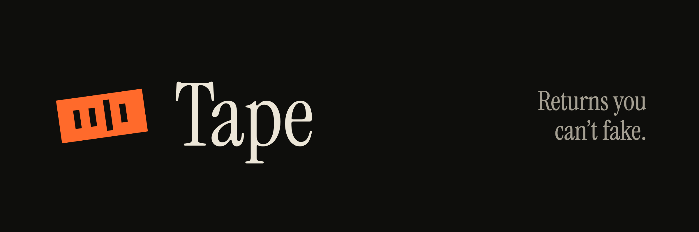</a>

<h3>Copy trading for tokenized stocks, where every return is proven on-chain.</h3>

<p>Managers run public vaults of Robinhood Stock Tokens. A Rust engine on Arbitrum Stylus stamps every return on an append-only tape. Followers copy with USDG and can leave in kind at any time.</p>

<p>
<a href="https://tape-verified.vercel.app"></a>
<a href="brag-output/brag.mp4"></a>
</p>

<p>


</p>

<p>
<a href="#-try-it-in-30-seconds"><b>Try it</b></a> ·
<a href="#-screenshots"><b>Screenshots</b></a> ·
<a href="#%EF%B8%8F-how-it-works"><b>How it works</b></a> ·
<a href="#-deployments"><b>Contracts</b></a> ·
<a href="#-proof"><b>Proof</b></a> ·
<a href="docs/SUBMISSION.md"><b>Submission</b></a>
</p>

<sub>Built for the <b>Arbitrum Open House Singapore</b> buildathon</sub>

</div>

<br />

<p align="center">
  <a href="brag-output/brag.mp4"></a>
  <br />
  <sub>Inspecting a vault's on-chain tape, then copying it with the demo wallet. <a href="brag-output/brag.mp4">Watch the full 65s demo ▸</a></sub>
</p>

---

## Contents

- [The problem](#-the-problem)
- [The solution](#-the-solution)
- [Try it in 30 seconds](#-try-it-in-30-seconds)
- [Screenshots](#-screenshots)
- [How it works](#%EF%B8%8F-how-it-works)
- [Why followers can trust a stranger's vault](#-why-followers-can-trust-a-strangers-vault)
- [Built with Arbitrum](#-built-with-arbitrum)
- [Deployments](#-deployments)
- [Proof](#-proof)
- [Run it locally](#-run-it-locally)
- [Repository map](#-repository-map)
- [Roadmap to mainnet](#-roadmap-to-mainnet)
- [Known limits](#%EF%B8%8F-known-limits)

---

## 🧾 The problem

Stock tips are sold on screenshots. Anyone can post "+312% this quarter" and nobody can check it.

<table>
<tr>
<td width="33%" valign="top">

**🇮🇳 India**<br />
A regulator built an agency just to verify returns. SEBI bars unregistered finfluencers from return claims and launched **PaRRVA** to verify past performance.

</td>
<td width="33%" valign="top">

**🇸🇬 Singapore**<br />
"Not financial advice" is no longer a shield. **MAS** rules on digital advertising now reach the content creators who promote financial products.

</td>
<td width="33%" valign="top">

**🪶 Robinhood**<br />
Verified, copyable trades exist, but inside one US app. **Robinhood Social** verifies trades for US users. Stock Tokens reach 120+ countries where that app isn't available.

</td>
</tr>
</table>

The demand for verified returns is real, and it isn't met where stock tokens are actually sold.

## ✅ The solution

On Tape, **the chain is the verification agency.**

| | |
|---|---|
| 🏦 **Public portfolio vaults** | A manager runs a portfolio of Robinhood Stock Tokens and USDG. Every trade goes through the vault, so nothing can be hidden, backdated or cherry-picked. |
| 📼 **The tape (Rust on Stylus)** | Every checkpoint appends the vault's net-of-fee share price to an append-only record keyed to the vault. Total return, max drawdown, volatility and Sharpe are **computed on-chain**, so any contract can gate on them. |
| 🖱️ **Copy in one click** | Followers deposit USDG and receive shares at oracle NAV. |
| 🚪 **Leave anytime, in kind** | Redemption is a pro-rata slice of every holding. It reads no oracle and needs no manager, even on a weekend. |

## ⚡ Try it in 30 seconds

1. Open **[tape-verified.vercel.app](https://tape-verified.vercel.app)** and click **Launch app**.
2. Click **Connect → Demo wallet**. You get testnet gas and **10,000 USDG** automatically, with no extension or bridging.
3. Open a vault (try **Mag 7 Equal Weight**), enter `1000` and click **Copy portfolio**.
4. Switch to **Exit**: slide to 50% and see exactly which stocks you would receive.
5. Optional: **Launch vault** to become a manager, then trade from **Manage** inside the oracle band and stamp a checkpoint.

> [!NOTE]
> The four demo vaults replayed **69 trading days of real Robinhood Chain mainnet Chainlink prices** (Jun 23 – Sep 30, 2026) through the real contracts, and are labelled *Replay* in the app. Testnet prices are mirrored live from mainnet by a serverless relay.

## 📸 Screenshots

<p align="center">
  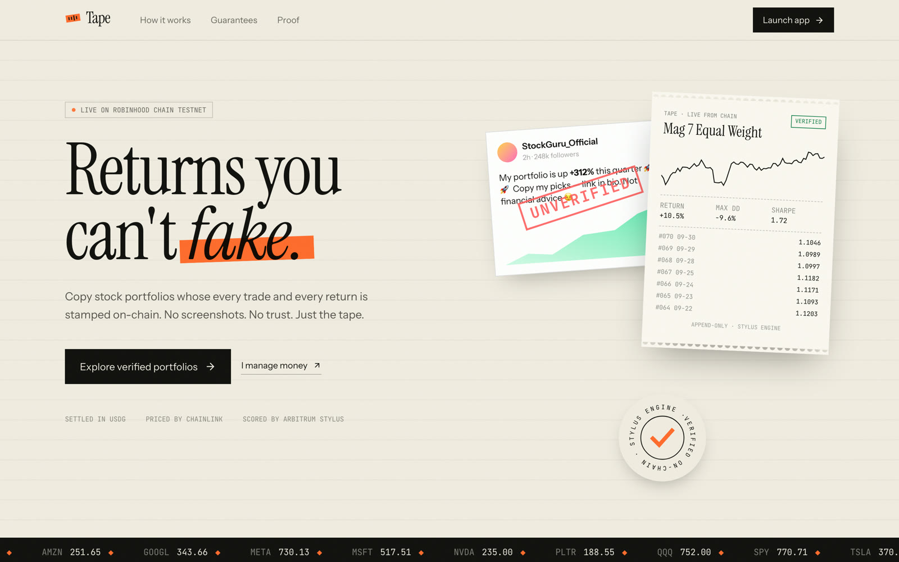
  <br /><sub><b>Landing:</b> a fake +312% post next to a receipt printed live from the chain</sub>
</p>

<p align="center">
  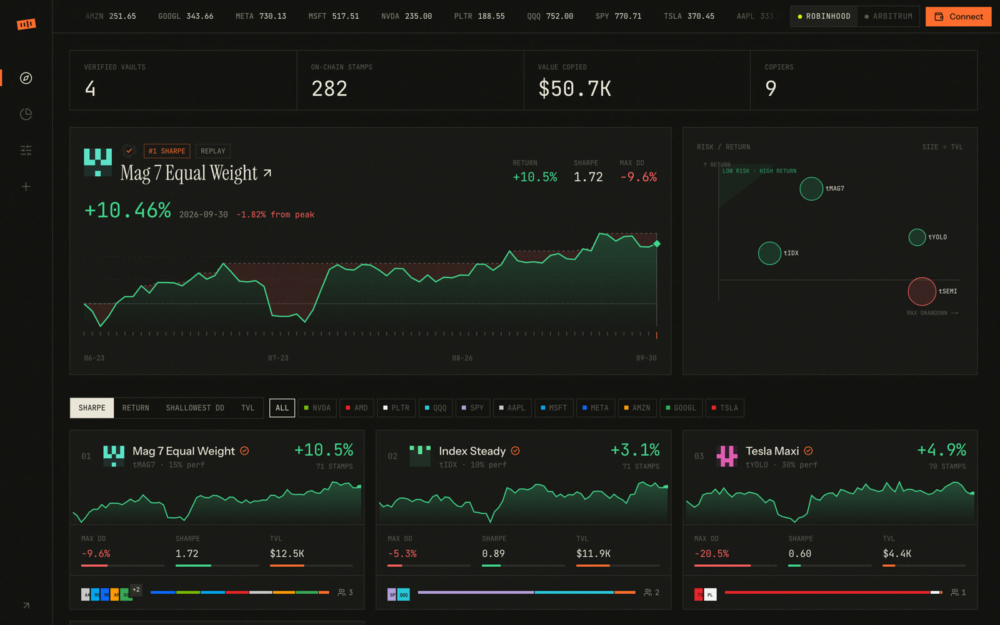
  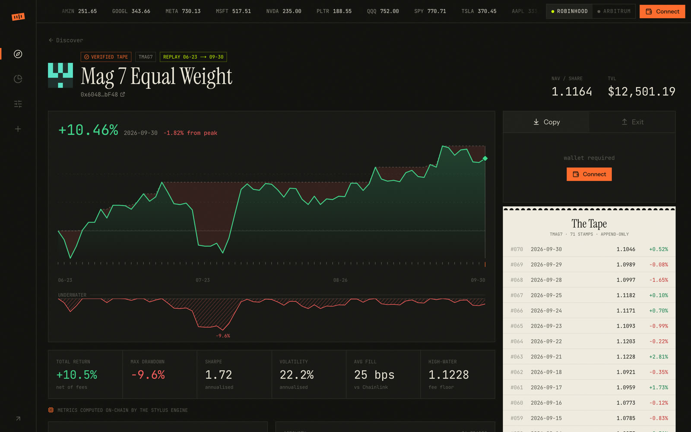
  <br /><sub><b>Discover:</b> verified vaults, the leader's equity curve, a risk/return map &nbsp;·&nbsp; <b>Vault:</b> one tick per on-chain checkpoint, drawdown, Stylus-computed metrics, the tape</sub>
</p>

<p align="center">
  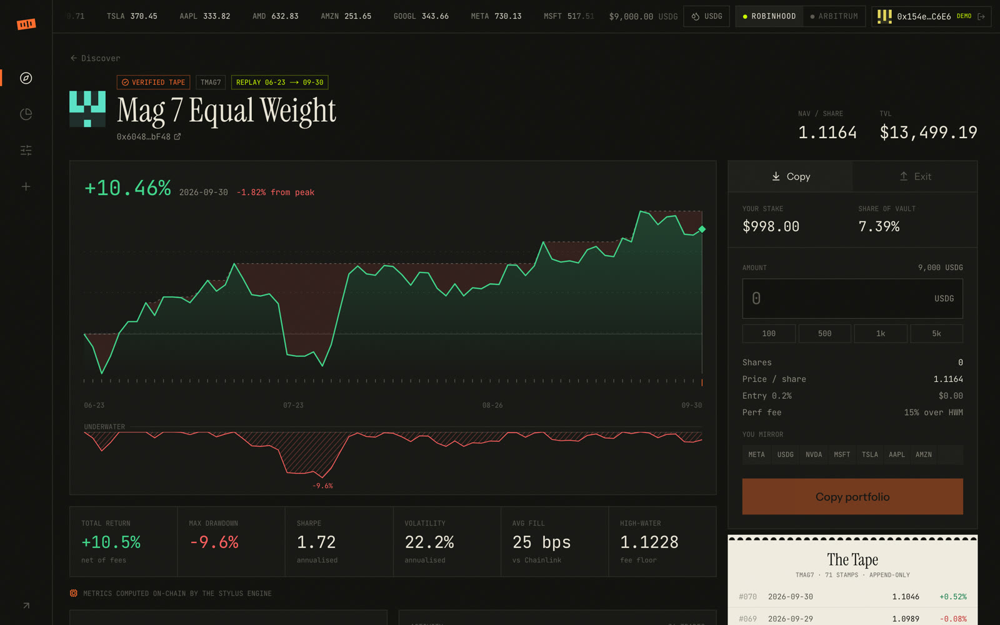
  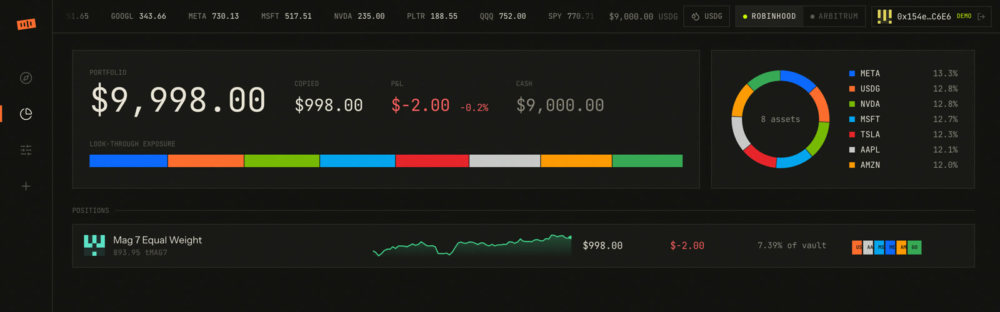
  <br /><sub><b>Copy:</b> $1,000 in, $998.00 stake after the 0.2% entry fee &nbsp;·&nbsp; <b>Portfolio:</b> look-through exposure across every copied vault</sub>
</p>

<p align="center">
  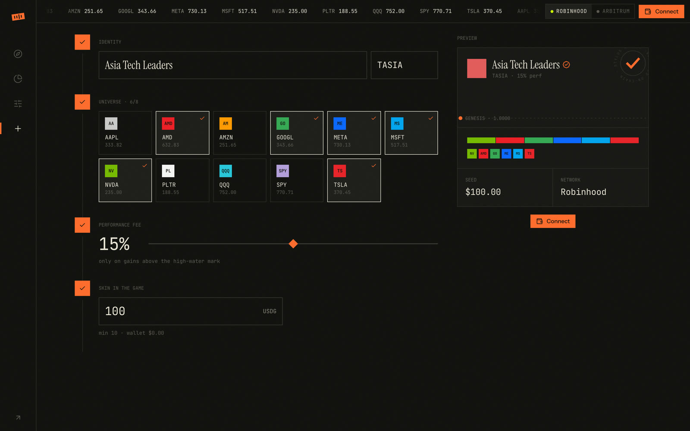
  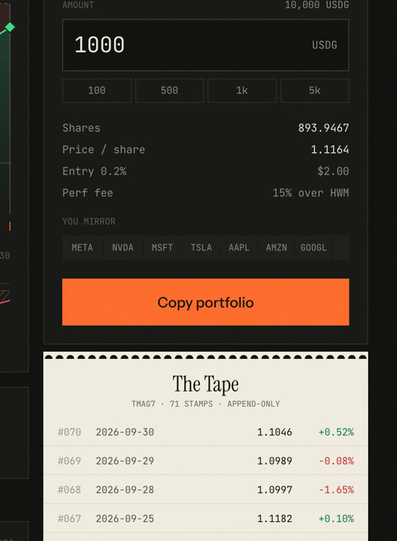
  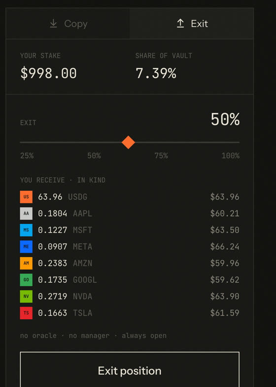
  <br /><sub><b>Launch:</b> pick a universe, set a fee, seed with your own USDG &nbsp;·&nbsp; <b>Copy / Exit:</b> shares at oracle NAV in; a slice of every stock out</sub>
</p>

<details>
<summary><b>📱 Mobile</b></summary>
<br />
<p align="center">
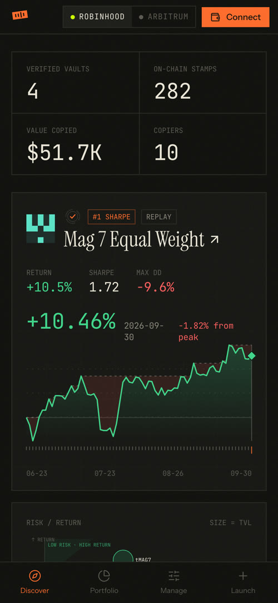
&nbsp;&nbsp;
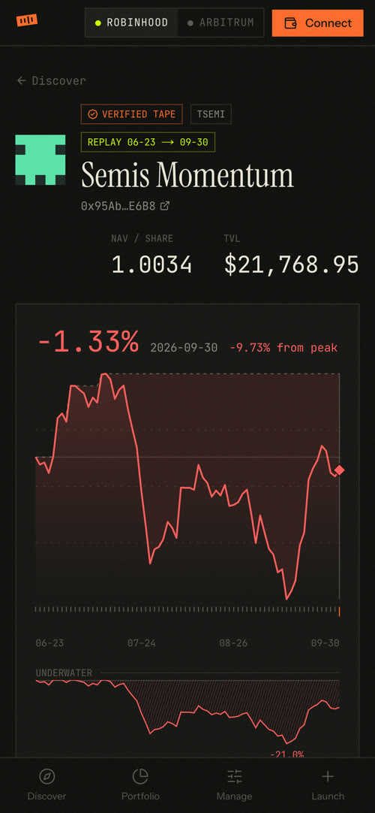
</p>
</details>

## ⚙️ How it works

<p align="center">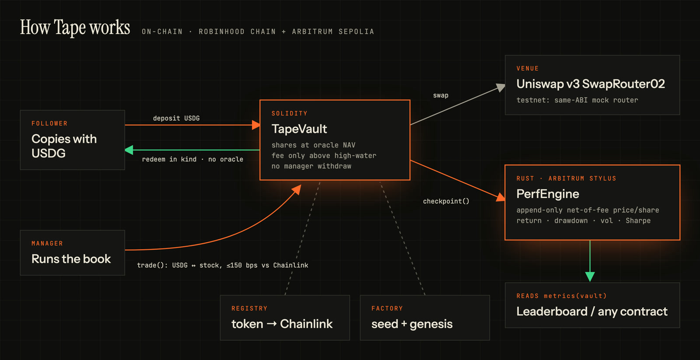</p>

1. **Launch.** `TapeFactory` creates a vault with a fixed asset list, takes the manager's own USDG seed (skin in the game) and stamps the genesis checkpoint.
2. **Trade.** The manager's only power is `trade()`: USDG ↔ a listed stock token through the router. The vault measures the fill by balance diff and reverts if it lands outside the oracle band.
3. **Stamp.** Anyone can call `checkpoint()`. It crystallises the performance fee (only above the high-water mark) and appends the net-of-fee price per share to the Stylus engine.
4. **Score.** `PerfEngine.metrics(vault)` returns total return, max drawdown, volatility and Sharpe, computed on-chain from the tape.
5. **Copy and exit.** Followers deposit USDG at oracle NAV and redeem in kind whenever they want.

## 🛡️ Why followers can trust a stranger's vault

| Guarantee | How it is enforced |
|---|---|
| Manager cannot take the money | The only manager action is `trade`, and only between USDG and the vault's fixed asset list, through the registry's router. There is no withdraw path for the manager. |
| Manager cannot trade at a bad price | Each fill is measured by balance diff and must land within `maxDevBps` of Chainlink. The cap is a hard 150 bps; a typical setting is 50. |
| Followers can always leave | `redeem` is pro-rata in kind and reads no oracle. It works on weekends, during feed outages, and if the manager vanishes. |
| The track record can't be faked | Only market moves, trades and fees move share price. Deposits and redemptions cannot move it (invariant-tested). Entry fees go to a treasury, never into the vault, so churn can't pad returns. |
| Fees only on real gains | The performance fee is minted as shares, only above the high-water mark. Tested: a recovery after a drawdown pays nothing. |
| Stale prices don't price deposits | Deposits, trades and checkpoints revert if any held asset's feed is older than `maxStaleness`. Robinhood stock feeds run 24/5. |

## 🔷 Built with Arbitrum

| | |
|---|---|
| **Arbitrum Stylus** | The track-record engine ([`engine/`](engine/src/lib.rs), 13.4 KB of Rust) stores the append-only tape and computes analytics on-chain. A bit-identical Solidity reference shares its test fixtures. |
| **Robinhood Chain** | An Arbitrum Orbit chain built for tokenized stocks. Tape uses the Chainlink stock feeds (prices per token, ERC-8056 multiplier included) and USDG as the cash leg. |
| **Arbitrum Sepolia** | The same contracts are deployed at the same addresses, with their own replay vaults. |
| **Paxos USDG** | The deposit asset, the quote asset for every trade, the cash leg of every portfolio and the unit of every fee. |

## 📍 Deployments

Addresses are identical on **Robinhood Chain testnet (46630)** and **Arbitrum Sepolia (421614)**.

| Contract | Address |
|---|---|
| PerfEngine (Stylus) | [`0xEF9611533407D99e9c287480955A2923d8d6cC96`](https://explorer.testnet.chain.robinhood.com/address/0xEF9611533407D99e9c287480955A2923d8d6cC96) |
| TapeFactory | [`0x031cBa7db6325aaA1D81533573D2A33B0fcC16Db`](https://explorer.testnet.chain.robinhood.com/address/0x031cBa7db6325aaA1D81533573D2A33B0fcC16Db) |
| AssetRegistry | [`0x7fc05a6FE237D5690886EC95BEFdaeFD3cAaF136`](https://explorer.testnet.chain.robinhood.com/address/0x7fc05a6FE237D5690886EC95BEFdaeFD3cAaF136) |
| Router (mock, same ABI as SwapRouter02) | `0xa8100b0C13D5eC28A0e38882Cfd051453AEbad6C` |
| USDG (mock, public faucet) | `0x91f85A812a43A27E03d514569dF2e9b3aEa27B42` |

Stock tokens and feeds for NVDA, AAPL, TSLA, MSFT, META, AMZN, GOOGL, SPY, QQQ, PLTR and AMD are listed in [`contracts/deployments/`](contracts/deployments/).

<details>
<summary><b>Why mocks on testnet?</b></summary>
<br />
Robinhood Chain testnet has no Stock Tokens, no stock Chainlink feeds and no Uniswap. The stand-ins share the mainnet ABIs, and a serverless relay (<code>web/src/app/api/relay</code>) batches live mainnet Chainlink prices into the testnet feeds in one transaction. The vault code is therefore identical on both networks, and the mainnet fork suite below runs it against the real thing.
</details>

## 🧪 Proof

<table>
<tr>
<td align="center" width="25%"><h2>19 bps</h2><sub>execution cost vs Chainlink, $18k through real Uniswap pools (mainnet fork)</sub></td>
<td align="center" width="25%"><h2>1.60×</h2><sub>cheaper <code>metrics()</code> on Stylus vs Solidity at 300 checkpoints</sub></td>
<td align="center" width="25%"><h2>32 + 5</h2><sub>Foundry tests (unit, fuzz, invariant) + Rust tests</sub></td>
<td align="center" width="25%"><h2>65,536</h2><sub>random calls in the largest invariant campaign, all passing</sub></td>
</tr>
</table>

**Same code, real market.** [`MainnetFork.t.sol`](contracts/test/fork/MainnetFork.t.sol) runs the testnet contracts against Robinhood Chain **mainnet** state: real USDG, real NVDA/AAPL/TSLA Stock Tokens, real Chainlink feeds and real Uniswap v3 pools.

```text
forge test --match-path 'test/fork/*' -vv
  NVDA bought: 34.59   AAPL bought: 18.06   TSLA bought: 11.20
  execution cost vs oracle: 19 bps (18,000 USDG across three pools)
  checkpoint + in-kind redemption of real stock tokens: ok
```

<details>
<summary><b>Stylus vs Solidity gas benchmark</b></summary>
<br />

[`scripts/bench.mjs`](scripts/bench.mjs) runs the same track records through the Stylus engine and the Solidity reference on a local Nitro devnode. Both return identical results for every size.

| Checkpoints | Solidity `metrics()` gas | Stylus `metrics()` gas | Stylus advantage |
|---|---|---|---|
| 30 | 143,489 | 128,851 | 1.11× |
| 70 | 300,482 | 219,070 | 1.37× |
| 150 | 612,126 | 402,452 | 1.52× |
| 300 | 1,196,520 | 746,235 | 1.60× |

The advantage grows with history length, because the analytics loop is compute-bound. `record()` currently costs more in Stylus (83.8k vs 51.2k gas). The Rust storage layout writes the price and the timestamp separately, while Solidity packs them into one slot. Packing them into one word is the next optimisation; it waits for an engine redeploy because vaults pin the engine address.
</details>

<details>
<summary><b>Tests and invariants</b></summary>
<br />

```bash
cd contracts && forge test     # 32 tests: unit, fuzz (512 runs), invariant (128 × 64 calls)
cd engine && cargo test        # 5 tests, incl. the same fixture as the Solidity reference
```

The invariants check that:
- money flows never dilute holders; rounding can only leave dust (at most 2 micro-USDG per flow) to the remaining holders;
- the high-water mark never decreases;
- router allowances are always cleared after a trade.

A bug found during testing: entry fees kept *inside* the vault raised share price, which let a manager pad their own track record by churning deposits. Fees now go to a treasury, and the invariant enforces it.
</details>

## 🛠 Run it locally

```bash
git clone --recursive https://github.com/codeswithroh/tape-verified && cd tape-verified
cp .env.example .env    # PRIVATE_KEY + RPCs
```

<details>
<summary><b>Deploy contracts</b></summary>
<br />

```bash
# 1. Stylus engine (use drpc / publicnode: the official public RPCs reject Stylus activation)
cd engine && cargo stylus deploy --endpoint $RH_TESTNET_STYLUS_RPC --private-key $PRIVATE_KEY --no-verify

# 2. Solidity side: registry, factory, mocks, listings
cd ../contracts && ENGINE=<engine address> forge script script/Deploy.s.sol --rpc-url $RH_TESTNET_RPC --broadcast --slow

# 3. Optional: replay real mainnet history through demo vaults
cd ../scripts && npm i && node history.mjs && CHAIN=46630 node seed.mjs
```
</details>

<details>
<summary><b>Run the web app</b></summary>
<br />

```bash
cd web && npm i
# web/.env.local: RELAY_PRIVATE_KEY (feed updater), DRIP_PRIVATE_KEY (demo-wallet gas faucet), RH_MAINNET_RPC
npm run dev    # http://localhost:3000
```
</details>

**Stack:** Rust · Stylus SDK 0.10 · Solidity 0.8.28 · Foundry · OpenZeppelin 5 · Next.js 16 · wagmi / viem · Tailwind 4 · Vercel · Chainlink · Uniswap v3

## 🗂 Repository map

| Path | What |
|---|---|
| [`engine/`](engine/) | Stylus PerfEngine (Rust): append-only tape and on-chain metrics |
| [`contracts/src/TapeVault.sol`](contracts/src/TapeVault.sol) | Vault: deposits, in-kind redemption, oracle-bounded trading, high-water-mark fee, checkpoints |
| [`contracts/src/TapeFactory.sol`](contracts/src/TapeFactory.sol) | Creates vaults with a manager seed and a genesis checkpoint |
| [`contracts/src/AssetRegistry.sol`](contracts/src/AssetRegistry.sol) | Curated stock tokens; only tokens with a Chainlink feed can be listed |
| [`contracts/src/PerfEngineRef.sol`](contracts/src/PerfEngineRef.sol) | Solidity reference engine with the same math; used in tests and the benchmark |
| [`contracts/src/mocks/`](contracts/src/mocks/) | Testnet stand-ins with mainnet ABIs, plus `FeedBatcher` for one-tx price relays |
| [`web/`](web/) | Next.js: landing (`/`), app (`/app`), and API routes `/api/relay` and `/api/drip` |
| [`scripts/`](scripts/) | Relay, history fetch, replay seeder, smoke test, gas benchmark |
| [`brag-output/`](brag-output/) | Demo video and its plan |
| [`docs/`](docs/) | Submission text, demo script, logo and banner |

## 🗺 Roadmap to mainnet

- [x] Vaults, factory, registry and Stylus engine on Robinhood Chain testnet and Arbitrum Sepolia
- [x] Mainnet fork suite against real USDG, Stock Tokens, Chainlink and Uniswap
- [x] Demo wallet, live price relay and replayed track records
- [ ] Pack `record()` storage into one word (engine v2)
- [ ] Deploy on Robinhood Chain mainnet with real USDG and Stock Tokens
- [ ] Onboard licensed managers first: Singapore RFMCs and SEBI-registered advisers
- [ ] Allocator vaults that only fund managers with a verified on-chain Sharpe ratio
- KPIs: verified vaults launched · value copied (TVL) · checkpoints stamped

## ⚠️ Known limits

- USDG is valued at $1. Only the ~40 stock tokens with Chainlink feeds on Robinhood Chain can be listed.
- The registry owner curates assets and feeds, a trust assumption to hand over to governance. A vault's router is fixed when the vault is created.
- A pooled vault managed for others may be a collective investment scheme. Tape is intended as infrastructure for licensed managers, and the verified track record also stands on its own.
- The demo vaults' on-chain timestamps are minutes apart, because the replay compressed 69 trading days into one session. [`scripts/data/replay-46630.json`](scripts/data/replay-46630.json) maps each stamp to its trading day.

<p align="right"><a href="#readme">back to top ↑</a></p>

<div align="center">
<sub>Tape · Returns you can't fake. · Built for the Arbitrum Open House Singapore buildathon</sub>
</div>
